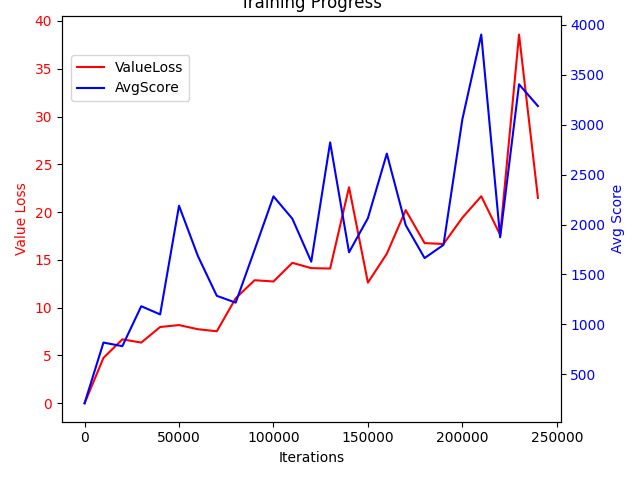

# Homework 5

## Install Necessary Packages
conda create -n hw5 python=3.11 -y
conda activate hw5
pip install -r requirements.txt


# Deep Q-Network for MsPacman

## Environment Setup

1. **Install Miniconda**:
    - Download and install Miniconda from the official website: [Miniconda](https://docs.conda.io/en/latest/miniconda.html).

2. **Create and Activate Virtual Environment**:
    - Follow the homework instructions to create and activate the hw5 virtual environment.

3. **Install Necessary Packages**:
    - After activating the virtual environment, install the required packages by running:
      ```sh
      pip install -r requirements.txt
      ```

## Training the Model

1. **Edit the Code**:
    - Ensure that you have edited `pacman.py` and `rl_algorithm.py` files as needed.

2. **Run the Training Script**:
    - Execute the training script by running:
      ```sh
      python pacman.py
      ```
    - Wait for the script to execute (a progress bar will indicate the progress).

3. **Output**:
    - After execution, you will find the following files generated in the `submissions` folder:
        - `pacman_dqn.pt`: The saved model weights.
        - `mspacman.mp4`: A video demonstrating the model in action.

## Evaluating the Model

1. **Run the Evaluation Script**:
    - Execute the evaluation script by running:
      ```sh
      python pacman.py --eval --eval_model_path '/home/vv1150n/AI/AI2024-hw5-v2/submissions/ALE-MsPacman-v5__pacman__1716040330/pacman_dqn.pt'
      ```

2. **Output**:
    - The evaluation script will print the score of the agent.

## Training Curve



## Evaluation Video


